## CAPITULO IV: PRODUCT DESIGN

### 4.1. Style Guidelines.

En esta sección, delineamos los principios de estilo que guiarán la creación de nuestro producto desde cero. Estas directrices establecerán un estándar para la elección de fuentes, tamaños y la paleta de colores necesarios en el proceso inicial de prototipado del diseño de **EduFocus**. Estas indicaciones serán una valiosa referencia para los integrantes del equipo, ofreciéndoles una comprensión clara sobre cómo implementar los diferentes elementos de diseño en todas las áreas y secciones de la plataforma. Esto conducirá a un considerable ahorro de tiempo y a una mayor uniformidad en el aspecto visual de **EduFocus**.

#### 4.1.1. General Style Guidelines.

En esta sección, se presentará la gama completa de colores que hemos establecido, así como los íconos, el logotipo y la fuente de texto elegidos. Estos elementos son fundamentales en la construcción de los estilos visuales que definirán la estética de nuestra plataforma web. Cada tono y diseño ha sido meticulosamente escogido para comunicar una identidad uniforme y distintiva en toda la aplicación, garantizando una experiencia visual atractiva para quienes la utilicen.

<div align="center" style="{}" >
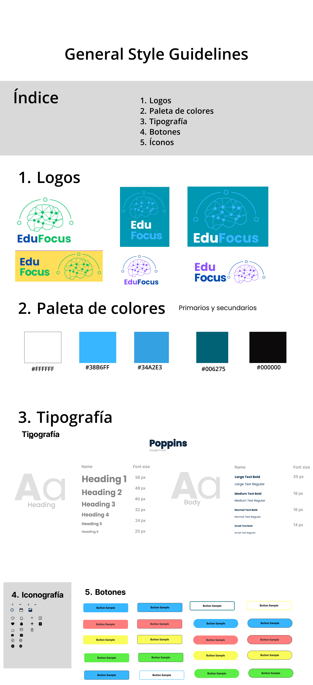
</div>

#### 4.1.2. Web Style Guidelines.

En esta sección, se presentará la gama completa de colores que hemos establecido, así como los íconos, el logotipo y la fuente de texto elegidos. Estos elementos son fundamentales en la construcción de los estilos visuales que definirán la estética de nuestra plataforma web. Cada tono y diseño ha sido meticulosamente escogido para comunicar una identidad uniforme y distintiva en toda la aplicación, garantizando una experiencia visual atractiva para quienes la utilicen. Se eligió la fuente Poppins de Google debido a que tiene un estilo moderno, también elegimos lo botones con borde redondeado y sin contorno para que hagan juego con la fuente. En cuanto a los íconos, los elegimos básandonos en la iconografía básica de muchas web applications.

<div align="center" style="{}" >
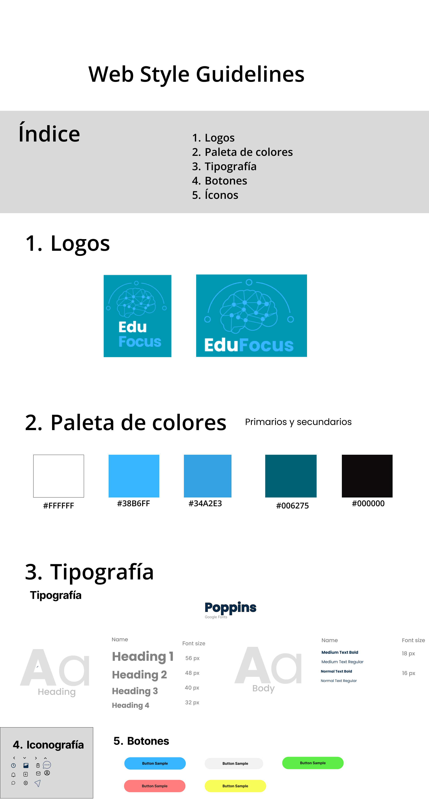
</div>

### 4.2. Information Architecture.

La finalidad principal de diseñar la arquitectura de la información es establecer una organización coherente y accesible para los usuarios, facilitando así que puedan descubrir, comprender y moverse con eficacia por el contenido.

#### 4.2.1. Organization Systems.

Como equipo, hemos acordado adoptar un formato jerárquico convencional, que se asemeja al enfoque de organización comúnmente utilizado en la mayoría de las páginas. Podríamos describir este enfoque de formato de la siguiente manera:

<div align="center" style="{}" >
  <strong>Landing page</strong>
</div>

* **Inicio**
   En esta sección será la pantalla de nuestro landing page, ya que permitirá a los usuarios registrarse e iniciar sesión en nuestra web application

* **Habilidades de estudio a desarrollar**
   En esta sección se indican algunas habilidades que el usuario logrará desarrollar gracias al uso de nuestro sistema
* **Estrategias para bienestar emocional**
   En esta sección se colocarán algunas estrategias que los estudiantes aprenderán para su bienestar emocional

* **Seguimiento académico**
   En esta sección se detalla sobre esa funcionalidad que tiene la web application
* **Call-to-action**
   Los usamos para poder lograr que nuestro usuario se interese en visitar nuesta web application
* **Footer**
   Está sección contendrá la información de contacto y referencias otras páginas 
#### 4.2.2. Labeling Systems.

Los "Sistemas de Etiquetado" son un conjunto de métodos y tácticas empleados para asignar nombres, etiquetas o títulos explicativos a elementos y secciones en una interfaz digital, como un sitio web, una aplicación móvil o una plataforma en línea.

 <div align="center" style="{}" >
  <strong>Landing page</strong>
</div>

Es crucial que las etiquetas utilizadas en la landing page coincidan con las que hemos detallado en la estructura previamente mencionada. Esta decisión se fundamenta en la navegación sencilla que nuestra página de inicio proporciona gracias a su diseño sin complicaciones. Asimismo, no tenemos la intención de incorporar múltiples alternativas que pudieran necesitar, por ejemplo, un motor de búsqueda.


#### 4.2.3. SEO Tags and Meta Tags

Las "etiquetas SEO" y las "etiquetas meta" son componentes del código HTML que se emplean en una página web para ofrecer datos suplementarios acerca del contenido de la página a los motores de búsqueda y a los visitantes

 <div align="center" style="{}" >
  <strong>Landing page</strong>
</div>

**SEO Tags:**

- Title Tag:

```
<title>EduFocus</title>
```

- Meta Description Tag:

```
<meta name="description" content=""EduFocus te ofrece recomendaciones de estudio personalizadas, estrategias para mejorar tu bienestar emocional y seguimiento de tu progreso académico y emocional. Con acceso a expertos en educación y psicología, nuestra plataforma facilita la interacción entre estudiantes y especialistas, proporcionando un entorno enriquecedor para tu desarrollo académico y emocional">
```

**Meta Tags:**

- Charset Meta Tag:

```
<meta charset="UTF-8">
```

- Viewport Meta Tag:

```
<meta name="viewport" content="width=device-width, initial-scale=1.0">
```

- Author Meta Tag:

```
<meta name="author" content="TechNest">
```

- Keywords Meta Tag (opcional):

```
<meta name="keywords" content="Educación personalizada,
Técnicas de estudios,
Salud emocional,
Bienestar mental,
Recomendaciones de estudio,
Seguimiento académico,
Plataforma educativa">
```

#### 4.2.4. Searching Systems.

Estos sistemas se han desarrollado con el propósito de agilizar la búsqueda de información, productos, servicios o cualquier tipo de contenido que responda a las necesidades y consultas de los usuarios de forma rápida

 <div align="center" style="{}" >
  <strong>Landing page</strong>
</div>

No aplicamos sistemas de búsqueda ya que no le consideramos conveniente, ya que la landing page no cuenta con servicios complejos ni tampoco una gran cantidad de información como para implementar algún sistema de búsqueda.


#### 4.2.5. Navigation Systems.

Los "Navigation Systems" (Sistemas de Navegación) se refieren a las estrategias y elementos utilizados en un diseño web o interfaz para guiar a los usuarios a través de la estructura y el contenido de un sitio web, aplicación u otra plataforma digital. Estos sistemas están diseñados para hacer que la navegación sea más intuitiva, eficiente y agradable para los usuarios, permitiéndoles encontrar la información que buscan y moverse entre diferentes secciones con facilidad.

 <div align="center" style="{}" >
  <strong>Landing page</strong>
</div>

1. **Navegación a través de Botones:**
   En la sección hero, un botón "Iniciar prueba" te llevará directamente a la web application. Esto garantiza una navegación rápida hacia la acción principal que deseamos que los usuarios tomen. Adicional a esto tenemos el botón de "Acceder" y "Registrarse", los cuales también nos llevarán al inicio de sesión de la web application.

2. **Footer - Navegación Rápida:**
   En la parte inferior de la página, el footer incluye una sección de navegación rápida. Aquí encontrarás botones que te llevarán a las secciones clave, como \*\*"Nosotros", "Otros servicios".

3. **Scroll Suave:**
   Implementa un scroll suave para que, al desplazarnos por la landing page el contenido aparezca lentamente con una animación


### 4.3. Landing Page UI Design.

#### 4.3.1. Landing Page Wireframe.

 <div align="center" style="{}" >
  <h3>Landing page para Desktop Web Browser</h3>
  
</div>

 <div align="center" style="{}" >
  <h3>Landing page para Mobile Web Browser</h3>
  
</div>

#### 4.3.2. Landing Page Mock-up.

  <div align="center" style="{}" >
  <h3>Landing page para Desktop Web Browser</h3>
   
</div>


 <div align="center" style="{}" >
  <h3>Landing page para Mobile Web Browser</h3>
   
</div>

### 4.4. Web Applications UX/UI Design.

#### 4.4.1. Web Applications Wireframes.

<div align="center" style="{}" >
   
   
   
   
   
   
   
   
   
   

   
   
   
   
   
</div>

#### 4.4.2. Web Applications Wireflow Diagrams.
En esta sección se mostrarán los wireflow de nuestra web application, para ello elaboraremos los steps y los Task Flows para casa User Goal.

1. **User Goal 1:**
   Registro de nuevos especialistas
   
    Como especialista quiero registrarme en la plataforma de EduFocus,para poder brindar mis servicios a los alumnos.

   * **Task Flow**
         
   * **Wireflow**
         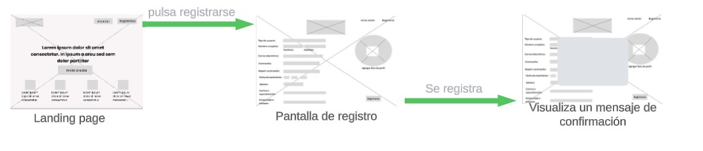

    
2. **User Goal 2:** Modificar datos de los especialistas

   Como especialista quiero 
  modificar mis datos de 
  usuario, para tener mi 
  perfil más personalizado.

   * **Task Flow**
      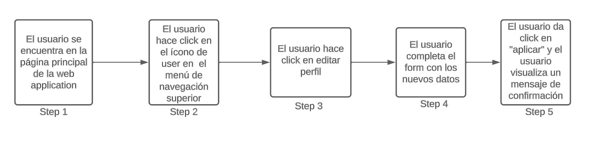
   * **Wireflow**
           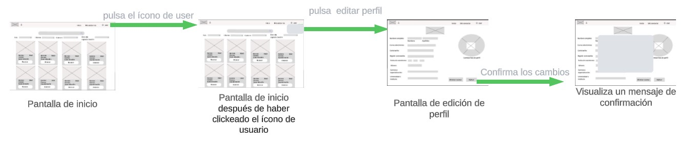
1. **User Goal 3:** Buscar 
especialistas por 
filtro

   Como estudiante quiero 
buscar a los especialistas 
por área de expertís, para
poder agendar una sesión.

   * **Task Flow**
   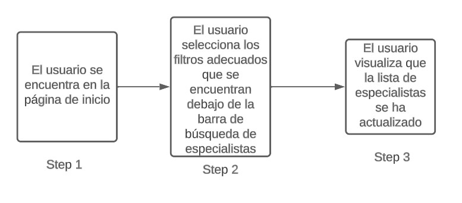
   * **Wireflow**
      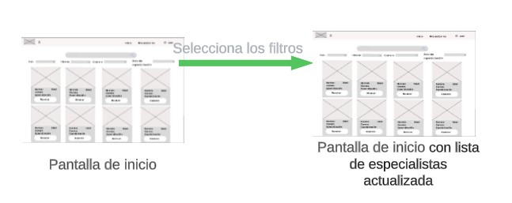

1. **User Goal 4:** Borrar 
especialista

    Como estudiante quiero 
  realizar un una queja o 
  reclamo, para hacer saber 
  que el especialista no 
  cumple las expectativas 
  necesarias
   * **Task Flow**
      
   * **Wireflow**
           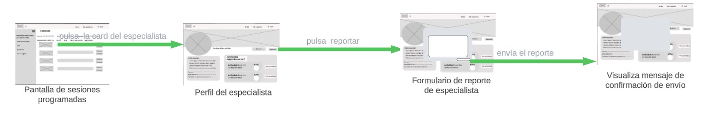

1. **User Goal 5:** Registro de nuevo estudiante
  
    Como estudiante quiero registrarme en la plataforma de EduFocus,para acceder al amplio catálogo de especialistas.

   * **Task Flow**
     
   * **Wireflow**         
   

2. User Goal 6: Buscar estudiantes por filtro

    Como especialista quiero buscar a los estudiantes que han reservado cita conmigo, para tener mejor organizado mis horarios y sesiones

   * **Task Flow**
       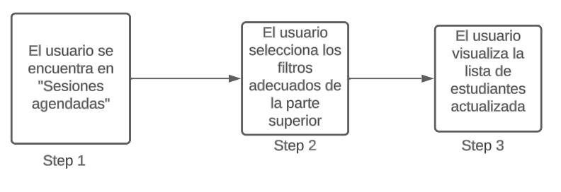

   * **Wireflow**
            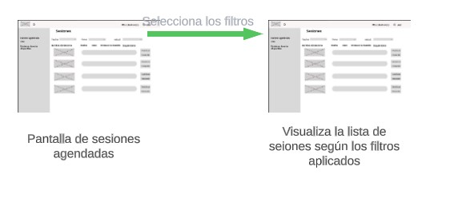

3. User Goal 7:Registro de nuevo seguimiento


    Como estudiante quiero tener un seguimiento de mis actividades encargadas por el especialista, para tener una mejor comprensión y adaptación de lo tratado en las sesiones.

   * **Task Flow**
      
   * **Wireflow**
            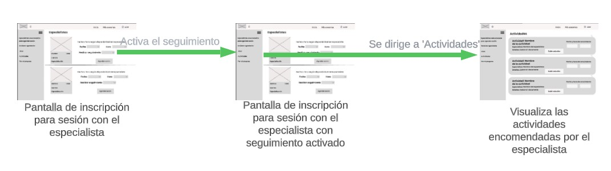

8. **User Goal 8:** Visualizar progreso de seguimiento

    Como estudiante quiero  visualizar mi progreso de las actividades de seguimiento, para tener un mejor entendimiento de mis avances
   * **Task Flow**
      
   * **Wireflow**
           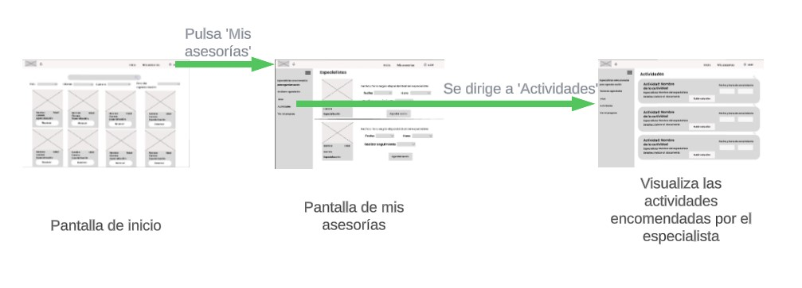

9.  **User Goal 9:** Eliminar cuenta

    Como estudiante o 
especialista quiero 
eliminar mi cuenta para 
dejar de usar los servicios 
de EduFocus

    * **Task Flow**
   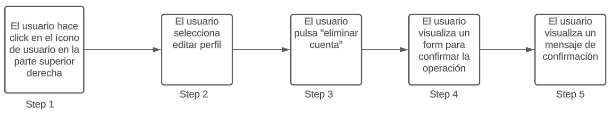
    * **Wireflow**
           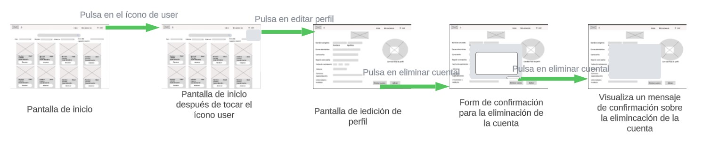


10.   **User Goal 10:** Eliminar sesión 
   
       Como estudiante quiero 
eliminar una sesión
agendada, porque decidí 
elegir a otro especialista 
de mi preferencia.

   * **Task Flow**
      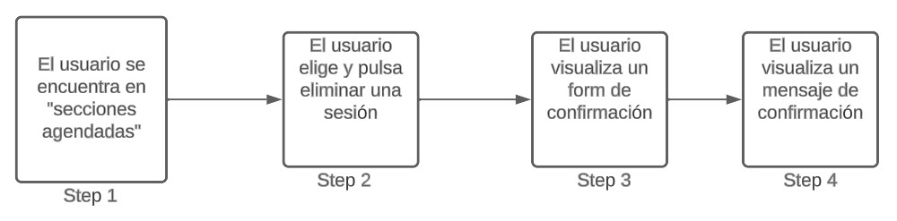
    * **Wireflow**
             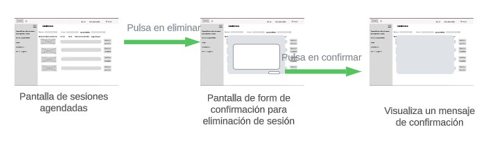

11.   **User Goal 11:** Crear nueva 
sesión

      Como estudiante quiero 
   crear una nueva sesión,
para empezar con las 
asesorías entre pares
   * **Task Flow**
      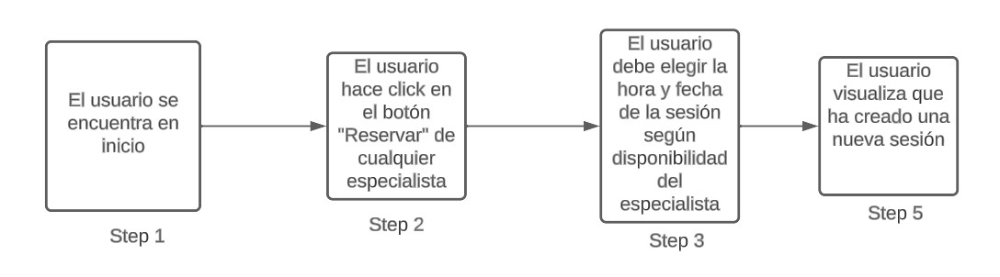
    * **Wireflow**
      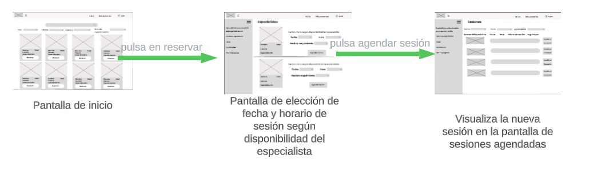

12.    **User Goal 12:** Modificar sesión

       Como estudiante quiero 
modificar una sesión
agendada, para cambiar la
fecha y hora de acuerdo 
con mi disponibilidad y la 
del especialista.
    * **Task Flow**
      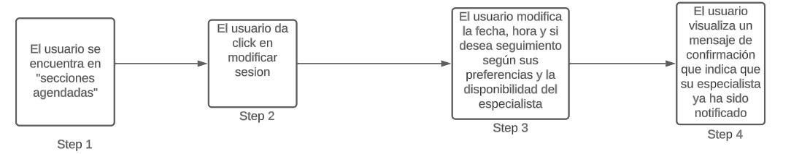
    * **Wireflow**
      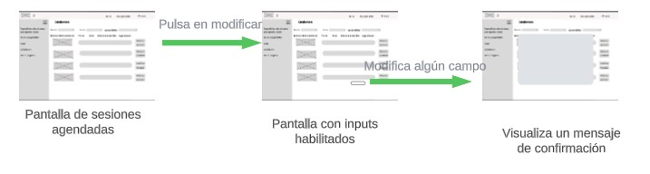


13.   **User Goal 13:** Buscar sesiones por filtro

      Como estudiante quiero 
   buscar mis sesiones 
agendadas, para tener un 
panorama general de mis 
asesorías.
    * **Task Flow**
      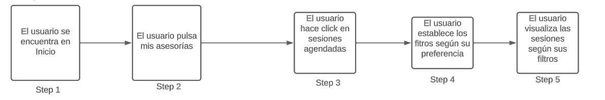
    * **Wireflow**
             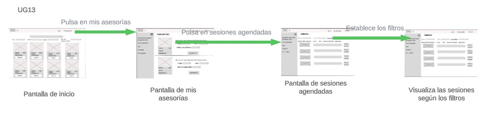

#### 4.4.2. Web Applications Mock-ups.

<div align="center" style="{}" >
   En esta ventana los usuarios se logearán para poder ingresar a nuestra web application
    

   Esta ventana es la del formulario de registro, nuestros usuarios podrán registrarse como especialistas o estudiantes
    
    Esta es la ventana de inicio para los que se registraron como estudiantes, se muestra la diversidad de especialistas que tiene la plataforma
    
   Esta es la ventana para crear una sesión con alguno de los especialistas según la disponibilidad de los mismos
    
    Esta es la ventana en la que se muestran todas las sesiones pendientes con los diversos especialistas
    
    Esta es la ventana de chat general, en dónde el estudiante podrá comunicarse con los especialistas con los que tiene sesiones pendientes
    
    Esta es la ventana de chat personal que tiene el estudiante con el especialista
    
    Esta es la ventana en la que el estudiante subirá las actividades asignadas por los diferentes especialistas con los que tiene una sesión programada
   
   En esta ventana se muestra el perfil del especialista y las actividades encargadas para mí
    
    En esta ventana  se muestra las calificaciones otorgadas por los especialistas respecto a las actividades asignadas.
    
    En esta ventana se muestra el chat personal abierto desde la perspectiva del especialista
  
  En esta ventana se muestran todos los chats con los diferentes alumnos que tienen programada una sesión con el especialista desde la perspectiva del mismo
  
  En esta ventana se muestra como los especialistas pueden definir su horario disponible para los estudiantes
  

  En esta sección se muestra el perfil del estudiante desde la perspectiva del especialista, el cual puede dejarle actividades personalizadas
  
  Y por último, en esta ventana se muestra todas las sesiones programadas por los alumnos desde la perspectiva del especialista
  

</div>

#### 4.4.3. Web Applications User Flow Diagrams.

### 4.5. Web Applications Prototyping.
<div align="center" style="{}" >

 **Web Application para estudiantes**
 
 
 ## [Enlace al prototipo para estudiantes](https://www.figma.com/proto/1wuLrsXCa0nid5h7kKGR0v/Dise%C3%B1os-de-Open-Source?page-id=171%3A1077&type=design&node-id=171-4040&viewport=1940%2C1959%2C0.34&t=vntF6vDSgXzPK0eR-1&scaling=scale-down&starting-point-node-id=171%3A4040&mode=design)
  
 **Web Application para especialistas**
 

  ## [Enlace al prototipo para especialistas](https://www.figma.com/proto/1wuLrsXCa0nid5h7kKGR0v/Dise%C3%B1os-de-Open-Source?page-id=171%3A3160&type=design&node-id=202-6686&viewport=874%2C347%2C0.16&t=mHXHZWFUPy9bfVar-1&scaling=scale-down&starting-point-node-id=202%3A6686&mode=design)
</div>
### 4.6. Domain-Driven Software Architecture.

#### 4.6.1. Software Architecture Context Diagram.

#### 4.6.2. Software Architecture Container Diagrams.

#### 4.6.3. Software Architecture Components Diagrams.

### 4.7. Software Object-Oriented Design.

#### 4.7.1. Class Diagrams.

#### 4.7.2. Class Dictionary.

### 4.8. Database Design.

#### 4.8.1. Database Diagram.
